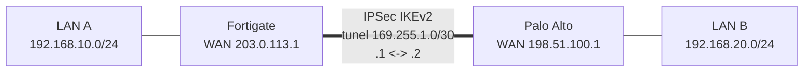

## Parte 1 - Automação de Switch Cisco com Frontend (Python + Flask + Netmiko)

Projeto que automatiza a configuração de **VLANs** e **hostname** em um switch Cisco IOS a partir de uma
interface web, incluindo **salvamento na NVRAM**, **backup da configuração** e **validação** do resultado
com alertas de divergência.

## Funcionalidades

| Requisito | Implementação |
|---|---|
| Frontend de VLANs | Interface web Flask (`app.py` + `templates/index.html`), VLANs 10/20/50 pré-preenchidas e editáveis, com botão para adicionar mais |
| Configuração de VLANs | `build_vlan_commands()` + Netmiko `send_config_set()` |
| Hostname | Campo no frontend (padrão `SWITCH_AUTOMATIZADO`) |
| Salvar configuração | `save_config()` do Netmiko (`write memory`) |
| Backup | `backup_config()` salva `backups/<hostname>_<antes\|depois>_<AAAAMMDD-HHMMSS>.cfg` |
| Validação | Compara `show vlan brief` e `show running-config \| include ^hostname` com o desejado; exibe ✔/✘ e alertas para VLANs fora do padrão |
| Testes | `tests/test_validation.py` (parsing e validação, sem necessidade de switch) |

## Estrutura

```
.
├── app.py                  # Frontend Flask
├── switch_automation.py    # Backend: conexão, configuração, backup e validação
├── templates/index.html    # Interface web
├── tests/test_validation.py
├── backups/                # Backups gerados (evidência)
├── docs/                   # Capturas de tela (evidências)
└── requirements.txt
```

## Instalação e execução

Pré-requisitos: Python 3.9+ e acesso SSH (ou Telnet em laboratório) ao switch.

```bash
git clone <URL_DO_REPOSITORIO>
cd <pasta>
python -m venv .venv
source .venv/bin/activate        # Windows: .venv\Scripts\activate
pip install -r requirements.txt
python app.py
```

Abra **http://127.0.0.1:5000** no navegador.

### Preparando o switch (laboratório)

```
hostname SW1
ip domain-name lab.local
crypto key generate rsa modulus 2048
ip ssh version 2
username admin privilege 15 secret Admin@123
enable secret Enable@123
interface vlan 1
 ip address 192.168.1.10 255.255.255.0
 no shutdown
line vty 0 4
 login local
 transport input ssh
```

Ambientes de teste: GNS3 / EVE-NG / Cisco CML com imagem IOSvL2, ou Cisco DevNet Sandbox.

## Como usar o frontend

1. Informe IP, protocolo (SSH/Telnet), usuário, senha e, se houver, o enable secret.
2. Confirme o hostname e as VLANs (padrão: 10 `VLAN_DADOS`, 20 `VLAN_VOZ`, 50 `VLAN_SEGURANCA`). Use **+ Adicionar VLAN** para incluir outras.
3. Clique em **Aplicar configuração**. (Marque *Modo simulação* para ver apenas os comandos que seriam enviados.)
4. A tela mostra o log, os backups gerados e o resultado da validação.

## Fluxo de execução

1. Conecta ao switch e gera **backup prévio** (`*_antes_*.cfg`)
2. Aplica as VLANs e altera o hostname
3. Reconecta (o prompt mudou), executa `write memory`
4. Gera **backup pós-configuração** (`*_depois_*.cfg`)
5. **Valida**: hostname e cada VLAN (ID + nome). VLANs existentes que não fazem parte do desejado (exceto 1 e 1002-1005) geram alerta

## Testes

```bash
pytest -v
```

## Notas de implementação

- **Nome "VLAN_SEGURANÇA"**: o IOS não aceita caracteres não ASCII em nomes de VLAN. O sistema converte automaticamente para `VLAN_SEGURANCA` e avisa na tela.
- A senha é usada apenas em memória durante a execução e não é gravada em disco ou log.
- Telnet é oferecido apenas para laboratório (ex.: Packet Tracer/GNS3); em produção use SSH.
- Backups podem conter dados sensíveis (hashes de senha); em produção, não os versione em repositório público.

## Evidências


> Backups e evidencias de exemplo: pasta `backups/`.


# Parte 2 — Plano de Automação: VPN IPSec Fortigate ↔ Palo Alto

> Documento de planejamento. Os arquivos de exemplo estão em `vpn/` e são **conceituais**:
> IPs são de documentação (RFC 5737) e os scripts não foram testados contra equipamentos reais.

## 1. Objetivo e escopo

Automatizar a criação de uma VPN IPSec **site-to-site, route-based, IKEv2** entre um Fortigate (Site A)
e um Palo Alto (Site B), com configuração idempotente, validação nos dois lados e alertas em caso de falha ou divergência.



## 2. Definição de parâmetros

### 2.1 Endereçamento

| Item | Fortigate (Site A) | Palo Alto (Site B) |
|---|---|---|
| IP WAN | 203.0.113.1/24 (`port1`) | 198.51.100.1/24 (`ethernet1/1`) |
| LAN de exemplo | 192.168.10.0/24 (`port2`) | 192.168.20.0/24 (`ethernet1/2`) |
| Rede de túnel | 169.255.1.0/30 | 169.255.1.0/30 |
| IP na interface de túnel | **169.255.1.1** | **169.255.1.2** |
| Interface de túnel | `VPN-TO-PA` (vinculada à `port1`) | `tunnel.1` (zona `VPN`) |

> **Atenção:** o enunciado pede `169.255.1.0/30`. Essa faixa **não é link-local** (o bloco link-local é `169.254.0.0/16`)
> e é espaço público roteável. Funciona tecnicamente para um enlace ponto a ponto privado, mas recomendo confirmar se não
> era `169.254.1.0/30`. Todos os arquivos usam o valor do enunciado e a mudança é uma única variável (`tunnel_network`).
> Um /30 tem apenas dois hosts utilizáveis (.1 e .2), exatamente o necessário.

### 2.2 Propostas (compatíveis nos dois fabricantes)

| Parâmetro | Phase 1 (IKE) | Phase 2 (IPSec/ESP) |
|---|---|---|
| Versão IKE | IKEv2 | n/a |
| Criptografia | AES-256-CBC | AES-256-CBC |
| Integridade/Hash | SHA-256 | HMAC-SHA-256 |
| Grupo DH | 14 (2048 bits) | 14 (PFS habilitado) |
| Lifetime | 28800 s (8 h) | 3600 s (1 h) |
| Autenticação | PSK (vinda de cofre/variável de ambiente) | n/a |
| DPD | Habilitado, intervalo 10 s | n/a |
| NAT-T | Desabilitado (IPs públicos diretos); habilitar se houver NAT | n/a |
| Seletores de tráfego (proxy-ID) | n/a | 192.168.10.0/24 ↔ 192.168.20.0/24 |

Escolhi AES-CBC + SHA-256 em vez de AES-GCM por ser o maior denominador comum entre versões de FortiOS e PAN-OS.
GCM pode ser uma melhoria futura (parametrizada). Grupos DH 14 ou superior (19/20/21) são preferíveis a 2 e 5, que são obsoletos.

### 2.3 Nomes de objetos

| Objeto | Fortigate | Palo Alto |
|---|---|---|
| Gateway/Phase 1 | `VPN-TO-PA` | `GW-TO-FG` |
| Phase 2 / Túnel | `VPN-TO-PA-P2` | `TUN-TO-FG` |
| Crypto profile | (inline na fase) | `IKE-AES256-SHA256` / `IPSEC-AES256-SHA256` |
| Objetos de endereço | `LAN-FG-192.168.10.0_24`, `LAN-PA-192.168.20.0_24` | `LAN-FG-192.168.10.0_24`, `LAN-PA-192.168.20.0_24` |

Todos os parâmetros ficam em um único arquivo de variáveis (`vpn/automation/vpn_params.json`), que é a **fonte única da verdade**.

## 3. Ferramentas e APIs

| Finalidade | Fortigate | Palo Alto |
|---|---|---|
| API REST | FortiOS REST API (`/api/v2/cfg/...` e `/api/v2/monitor/...`) com token de API (admin com perfil restrito) | PAN-OS XML API (`/api/?type=config`, `type=op`, `type=commit`) e REST API (`/restapi/...`) |
| SDK/Biblioteca Python | `requests`; `pyFG`/`fortiosapi` | `pan-os-python`, `pan-python`, `requests` |
| SSH/CLI | `netmiko` (`fortinet`) | `netmiko` (`paloalto_panos`) |
| Infra como código | Ansible `fortinet.fortios`, Terraform provider `fortios` | Ansible `paloaltonetworks.panos`, Terraform provider `panos` |
| Gerência centralizada | FortiManager (JSON-RPC, device/policy packages) | Panorama (templates e device groups) |
| Outros | Jinja2 (templates), HashiCorp Vault / variáveis de ambiente (segredos), Git + CI (GitLab CI/GitHub Actions) | |

**Escolha para este projeto:** Python com `requests` (REST do Fortigate) e `netmiko` (comandos `set` no Palo Alto), com
templates Jinja2 no caminho de evolução. Em produção, minha recomendação seria Ansible/Terraform, pela idempotência e
gerência de estado nativas, ou FortiManager/Panorama quando já existirem.

## 4. Passos de automação

Ordem lógica do script (`vpn/automation/deploy_vpn.py`):

1. **Carregar e validar parâmetros**: checar formato dos IPs, overlap entre LANs, /30 do túnel e presença do PSK (variável de ambiente).
2. **Pré-checagens**: alcançabilidade da API/SSH, versão do firmware, existência de interfaces e zonas, e conflito com objetos já existentes.
3. **Backup da configuração atual** dos dois equipamentos (ponto de rollback).
4. **Fortigate (aplicação imediata):**
   1. Objetos de endereço das LANs.
   2. Phase 1 (`vpn.ipsec/phase1-interface`): IKEv2, proposta, DH, PSK, DPD, remote-gw.
   3. Phase 2 (`vpn.ipsec/phase2-interface`): proposta, PFS, lifetime, seletores.
   4. IP da interface de túnel (169.255.1.1, remote-ip 169.255.1.2).
   5. Rota estática para a LAN B via interface de túnel.
   6. Políticas de firewall nos dois sentidos (LAN→VPN e VPN→LAN), com log.
5. **Palo Alto (candidate config + commit):**
   1. Objetos de endereço.
   2. IKE crypto profile e IPSec crypto profile.
   3. Interface `tunnel.1` com 169.255.1.2/30, zona `VPN` e virtual router.
   4. IKE gateway (IKEv2, PSK, DPD, peer 203.0.113.1).
   5. IPSec tunnel com proxy-ID, rota estática para a LAN A via `tunnel.1`.
   6. Security policies nos dois sentidos, com log-at-session-end.
   7. **Commit** (e acompanhar o job até `FIN/OK`).
6. **Estabelecimento do túnel**: iniciar tráfego interessante ou forçar a negociação (`diagnose vpn ike gateway`/`test vpn ike-sa` no PAN-OS) e aguardar a SA subir (timeout configurável).
7. **Validação** (seção 6) e **alertas**.
8. **Rollback automático** em caso de falha crítica (restaurar backup/revert do candidate) e commit do resultado no Git.

Princípios: **idempotência** (ler antes de escrever; `PUT` se existe, `POST` se não), **dry-run** e logs sem segredos.

## 5. Considerações específicas (ambiente heterogêneo)

| Tema | Desafio | Mitigação |
|---|---|---|
| Terminologia | Fortigate: Phase 1/Phase 2. Palo Alto: IKE Gateway/IPSec Tunnel + crypto profiles. | Modelo de dados neutro e *mapeadores* por fabricante. |
| Nomes de algoritmos | `aes256-sha256` vs `aes-256-cbc` + `sha256`; DH `14` vs `group14`. | Tabela de tradução no código. |
| Unidades de lifetime | Segundos vs horas/minutos. | Normalizar para segundos no modelo e converter por plataforma. |
| Proxy-ID / seletores | Mismatch gera Phase 2 falha (causa clássica de erro). PA com proxy-ID vazio usa 0.0.0.0/0; Fortigate usa seletores explícitos. | Definir os mesmos seletores nos dois lados e validar por comparação. |
| Modelo de commit | Fortigate aplica na hora; Palo Alto usa candidate + commit (pode demorar e conflitar com outros admins). | Aplicar o PA e commitar com controle de job; considerar lock de configuração. |
| IPs da interface de túnel | Fortigate usa /32 + remote-ip; PA usa /30 na `tunnel.1`. | Tratar como particularidade do mapeador. |
| Política de segurança | Fortigate: interface-based. PA: zone-based (precisa de zona `VPN`). | Criar zona/vínculo antes da regra. |
| Roteamento e MTU/MSS | Blackhole ou fragmentação com overhead de ESP. | Rotas estáticas explícitas e MSS clamping (~1350–1400). |
| Rekey e DPD | Divergência de timers causa flaps; colisão de rekey. | Lifetimes iguais ou lifetime do iniciador menor; DPD ativo nos dois. |
| NAT-T | Necessário se algum lado estiver atrás de NAT. | Parametrizar; verificar `ike-id`/peer identity. |
| Segredos | PSK trafegando em scripts, logs e Git. | Cofre/variáveis de ambiente, `.gitignore`, mascarar logs. |
| Autenticação de API | Token Fortigate (com trusted hosts) vs API key PAN-OS. | Contas dedicadas com privilégio mínimo. |
| Versionamento | Endpoints/campos mudam entre versões do FortiOS/PAN-OS. | Detectar versão na pré-checagem e fixar versões suportadas. |
| Falha parcial | Um lado aplicado e o outro não. | Backup nos dois lados e rollback conjunto. |

## 6. Validação de configuração e alertas

### 6.1 Validação em duas camadas

**A) Configuração (drift): o que foi aplicado confere com o desejado?**
Ler a configuração de volta via API e comparar campo a campo com `vpn_params.json`.

| Item | Fortigate | Palo Alto |
|---|---|---|
| Phase 1 / IKE gateway | `GET /api/v2/cfg/vpn.ipsec/phase1-interface/VPN-TO-PA` ou `show vpn ipsec phase1-interface` | `show network ike gateway GW-TO-FG` (config) |
| Phase 2 / IPSec | `GET /api/v2/cfg/vpn.ipsec/phase2-interface/...` | `show network tunnel ipsec TUN-TO-FG` |
| Interface de túnel / IP | `GET /api/v2/cfg/system/interface/VPN-TO-PA` | `show network interface tunnel` |
| Rotas | `get router info routing-table static` | `show routing route` |
| Políticas | `GET /api/v2/cfg/firewall/policy` | `show running security-policy` |

Divergências esperadas e tratadas: proposta diferente, lifetime, DH, seletores, IP de túnel, regra ausente.

**B) Operacional: o túnel está de fato funcionando?**

| Verificação | Fortigate | Palo Alto |
|---|---|---|
| IKE SA (Phase 1) | `get vpn ike gateway VPN-TO-PA` | `show vpn ike-sa gateway GW-TO-FG` |
| IPSec SA (Phase 2) | `diagnose vpn tunnel list name VPN-TO-PA` / `GET /api/v2/monitor/vpn/ipsec` | `show vpn ipsec-sa tunnel TUN-TO-FG` |
| Forçar negociação | `diagnose vpn ike gateway clear` (cuidado) / tráfego de teste | `test vpn ike-sa gateway GW-TO-FG`, `test vpn ipsec-sa tunnel TUN-TO-FG` |
| Contadores | bytes/pacotes tx/rx no monitor | `show vpn flow name TUN-TO-FG` |
| Logs | `execute log filter category event` + `execute log display` (filtro vpn) | `show log system direction equal backward` |
| Dataplane | Ping do IP remoto do túnel e ping/TCP entre hosts das LANs (`vpn/tests/test_tunnel.py`) | idem |

Critério de sucesso: SA de Phase 1 e Phase 2 em `up/active` nos dois lados, contadores de tráfego crescendo nos dois sentidos, ping entre 169.255.1.1 ↔ .2 e entre hosts das LANs OK.

### 6.2 Alertas

| Severidade | Condição | Ação |
|---|---|---|
| **Crítico** | Falha de API/commit, rollback executado, túnel down após timeout, Phase 1 ou Phase 2 não estabelecida | Webhook (Slack/Teams) + e-mail + ticket |
| **Alto** | Divergência de configuração (drift), SA up em apenas um lado, perda de pacotes acima do limiar | Webhook + e-mail |
| **Médio** | Latência acima do limiar, rekey frequente, DPD acionado | Webhook |
| **Info** | Deploy concluído com sucesso | Log/Git |

Implementação:
- O script de deploy e o de teste retornam **exit codes** distintos (0 OK, 1 divergência, 2 túnel down, 3 erro de execução), consumíveis por CI/cron.
- Monitoramento contínuo a cada 1–5 min via cron/CI, ou Prometheus + Alertmanager.
- Complementos nativos: SNMP/Syslog dos firewalls para SIEM/NMS, e *Automation Stitches* no Fortigate (evento de tunnel down → webhook).
- Alertas incluem: dispositivo, parâmetro divergente (esperado vs encontrado), horário e passo de diagnóstico sugerido.

## 7. Estrutura do repositório (Parte 2)

```
docs/parte2-plano-automacao-vpn-ipsec.md   # este documento
vpn/fortigate/ipsec_vpn.conf               # CLI do Fortigate
vpn/paloalto/ipsec_vpn.set                 # comandos set do PAN-OS
vpn/automation/vpn_params.json             # fonte única de parâmetros
vpn/automation/deploy_vpn.py               # script de automação (conceitual)
vpn/tests/test_tunnel.py                   # teste de conectividade
```

## 8. Riscos e melhorias futuras

- Migrar para Ansible/Terraform (estado e idempotência nativos) ou FortiManager/Panorama.
- Suporte a certificados (PKI) em vez de PSK, e a AES-GCM / DH 19-21.
- Túneis redundantes (dual-WAN), BGP sobre túnel e SD-WAN.
- Testes automatizados em laboratório (EVE-NG/GNS3/imagens VM de ambos os fabricantes).
- Pipeline CI com lint, dry-run e aprovação manual antes do deploy.

> Os comandos exatos podem variar conforme a versão de FortiOS/PAN-OS e devem ser validados em laboratório antes de uso em produção.

